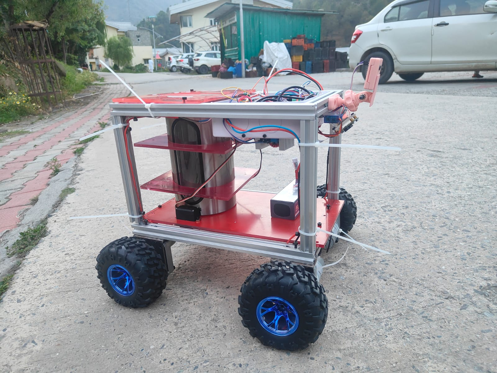
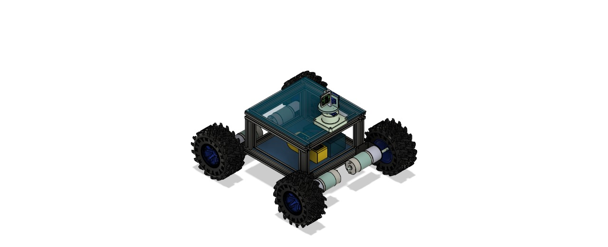
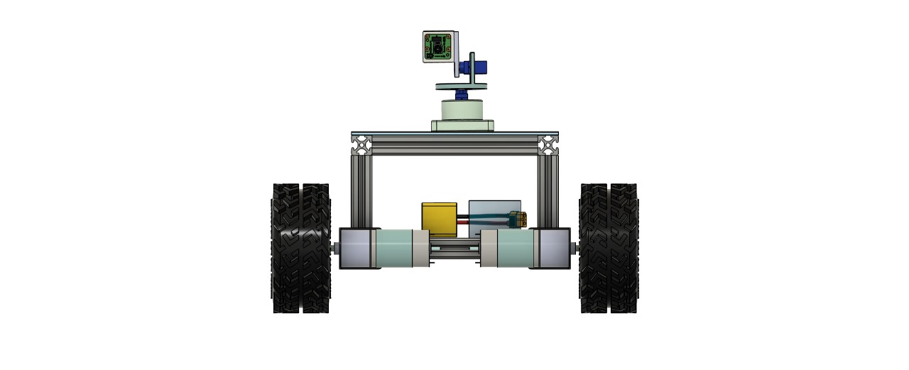

# Bitumen Buddy – Semi-Autonomous Pothole Detection & Filling Robot

## Description
**Bitumen Buddy** is a **semi-autonomous robot** developed during the *Design Practicum at IIT Mandi*.  
It detects potholes, estimates their volume using **Arducam ToF camera + Open3D**, and dispenses filler material with a **dual-servo mechanism**. The robot features a **4WD platform** with Arduino motor control, GPS logging, and RC override for manual operation.

## Features
- Semi-autonomous pothole detection and filling  
- 4WD mobility platform with GPS logging and RC override  
- Depth-based volume estimation with Arducam ToF + Open3D  
- Dual-servo dispensing system for controlled material delivery  
- Modular and robust chassis for field deployability  

## Technical Stack
- **Hardware:** Arduino, Raspberry Pi, Arducam ToF Camera, Dual Servo Mechanism  
- **Software:** Python, Open3D, YOLOv6, GPS logging  
- **Design Tools:** CAD modeling (Isometric & Front views), Embedded C for motor control  

## Media

### Robot Prototype

### CAD Renders
| Isometric | Front |
|-----------|-------|
|  |  |

### Project Poster

  

## Project Report
📄 [Download Report (PDF)](report.pdf)  

## Skills Demonstrated
- Embedded Systems (Arduino motor control, GPS logging, RC override)  
- Computer Vision (YOLOv6 pothole detection)  
- 3D Data Processing (Arducam ToF + Open3D for volume estimation)  
- CAD Design and Mechatronic Integration  

## Future Work
- Optimize real-time detection performance with faster models  
- Improve material dispensing precision  
- Integrate SLAM for fully autonomous navigation
